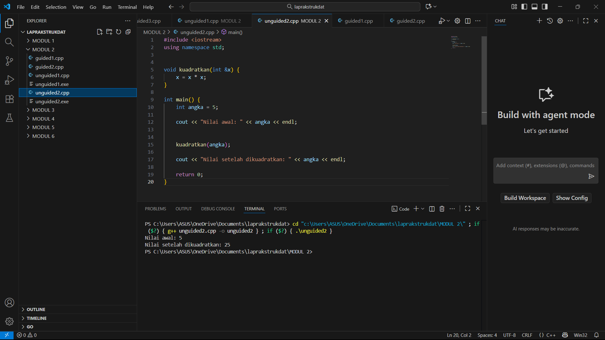

# muhammadihsansinaga103112430219-MODUL2

# <h1 align="center">Laporan Praktikum Modul 02 <br> PENGENALAN BAHASA C++ (BAGIAN KEDUA)</h1>
<p align="center">MUHAMMAD IHSAN SINAGA - 103112430219</p>

## Dasar Teori
Dasar teori program tersebut berhubungan dengan konsep fungsi dan pemanggilan melalui referensi (call by reference) dalam C++. Pada metode ini, yang diteruskan ke fungsi adalah alamat memori dari variabel asli, bukan duplikatnya. Akibatnya, setiap perubahan yang dilakukan pada parameter di dalam fungsi akan langsung mempengaruhi nilai variabel sebenarnya di luar fungsi tanpa perlu pengembalian nilai.
## Guided

### array
```go
#include <iostream>
using namespace std;

int main() {

    int nilai[5] = {1, 2, 3, 4, 5};

    for ( int i = 0;  i < 5; i++)
    {
       
        cout << "elemen ke-" << i << "=" << nilai[i] << endl;
    }
    return 0;
} 
```

### array 2
```go
#include <iostream>
using namespace std;

int main()
{
    char pesan_array[] = "Nasi Padang";
    char *pesan_pointer = "Ayam Bakar 23";

    cout << "String Array : " << pesan_array << endl;
    cout << "String Pointer : " << pesan_pointer << endl;

    // Mengubah karakter dalam array diperbolehkan
    pesan_array[0] = 'h';
    cout << "String Array setelah diubah: " << pesan_array << endl;

    // Pointer dapat diubah untuk menunjuk ke string lain
    pesan_pointer = "Sariaman";
    cout << "String Pointer setelah menunjuk ke string lain: " << pesan_pointer << endl;

    return 0;
}
```


### matriks
```go
#include <iostream>
using namespace std;

int main(){
    int matriks[3][3] ={
        {1, 2, 3},
        {4, 5, 6},
        {7, 8, 9}};

    for (int i = 0; i < 3; i++)
        {
        for (int j = 0; j < 3; j++)
    {
            cout << matriks[i][j]<< " ";
    }
    cout << endl;

    }
    return 0;
}
```

### pointer
```go
#include <iostream>
using namespace std;

int main()
{
    int umur = 25;
    int *p_umur;

    p_umur = &umur;

    cout << "Nilai 'umur': " << umur << endl;
    cout << "Alamat memori 'umur': " << &umur << endl;
    cout << "Nilai 'p_umur' (alamat): " << p_umur << endl;
    cout << "Nilai yang diakses 'p_umur': " << p_umur << endl;
    cout << "Alamat memori dari pointer 'p_umur' itu sendiri: " << p_umur << endl;
    return 0;
}
```

### array_pointer
```go
#include <iostream>
using namespace std;

int main()
{
    int data[5] = {10, 20, 30, 40, 50};
    int *p_data = data;

    cout << "Mengakses elemen array cara normal:" << endl;

    for (int i = 0; i < 5; ++i)
    {
        cout << "Nilai elemen ke-" << i << " : " << data[i] << endl;
    }

    cout << "Mengakses elemen array menggunakan pointer:" << endl;

    for (int i = 0; i < 5; ++i)
    {
        cout << "Nilai elemen ke-" << i << " : " << *(p_data + i) << endl;
    }

    return 0;
}
```

### string_pointer
```go
#include <iostream>
using namespace std;

int main()
{
    char pesan_array[] = "Nasi Padang";
    char *pesan_pointer = "Ayam Bakar 23";

    cout << "String Array: " << pesan_array << endl;
    cout << "String Pointer: " << pesan_pointer << endl;

    // Mengubah karakter dalam array diperbolehkan
    pesan_array[0] = 'h';
    cout << "String Array setelah diubah: " << pesan_array << endl;

    // Pointer dapat diubah untuk menunjuk ke string lain
    pesan_pointer = "Sariman";
    cout << "String Pointer setelah menunjuk ke string lain: " << pesan_pointer << endl;

    return 0;
}
```

### call by pointer

```go
#include <iostream>
using namespace std;

int main()
{
    int a = 10, b = 20;
    cout << "Sebelum ditukar: a = " << a << ", b = " << b << endl;
    tukar(&a, &b);
    cout << "Setelah ditukar: a = " << a << ", b = " << b << endl;
    return 0;
}

void tukar(int *px, int *py)
{
    int temp = *px;
    *px = *py;
    *py = temp;
}
```

### call by reference

```go
#include <iostream>
using namespace std;

int main()
{
    int a = 10, b = 20;
    cout << "Sebelum ditukar: a = " << a << ", b = " << b << endl;
    tukar(a, b);
    cout << "Setelah ditukar: a = " << a << ", b = " << b << endl;
    return 0;
}

void tukar(int &x, int &y)
{
    int temp = x;
    x = y;
    y = temp;
}
```

## Unguided

### Soal 1

Buatlah sebuah program untuk melakukan transpose pada sebuah matriks persegi berukuran 3x3. Operasi transpose adalah mengubah baris menjadi kolom dan sebaliknya. Inisialisasi matriks awal di dalam kode, kemudian buat logika untuk melakukan transpose dan simpan hasilnya ke dalam matriks baru. Terakhir, tampilkan matriks awal dan matriks hasil transpose.

Contoh Output:

Matriks Awal:
1 2 3
4 5 6
7 8 9

Matriks Hasil Transpose:
1 4 7
2 5 8
3 6 9


```go
#include <iostream>
using namespace std;

void transposeMatriks(int m[3][3], int hasil[3][3]) {
    for (int i = 0; i < 3; i++) {
        for (int j = 0; j < 3; j++) {
            hasil[j][i] = m[i][j];
        }
    }
}

void tampilkanMatriks(int m[3][3]) {
    for (int i = 0; i < 3; i++) {
        for (int j = 0; j < 3; j++) {
            cout << m[i][j] << " ";
        }
        cout << endl;
    }
}

int main() {
    int matriks[3][3] = {
        {1, 2, 3},
        {4, 5, 6},
        {7, 8, 9}
    };
    int hasil[3][3];

    cout << "Matriks Awal:" << endl;
    tampilkanMatriks(matriks);

    transposeMatriks(matriks, hasil);

    cout << "\nMatriks Hasil Transpose:" << endl;
    tampilkanMatriks(hasil);

    return 0;
}
```

> Output
> 

Program ini menampilkan matriks 3x3 dan hasil transposenya. Fungsi transpose() menukar posisi baris dan kolom dari matriks asal ke matriks hasil. Fungsi cetakMatriks() digunakan untuk menampilkan isi matriks ke layar. Di dalam main(), program mendefinisikan matriks awal, menampilkannya, lalu memanggil fungsi transpose() untuk menghasilkan dan menampilkan matriks hasil transpose.


### Soal 2

Buatlah program yang menunjukkan penggunaan call by reference. Buat sebuah prosedur bernama kuadratkan yang menerima satu parameter integer secara referensi (&). Prosedur ini akan mengubah nilai asli variabel yang dilewatkan dengan nilai kuadratnya. Tampilkan nilai variabel di main() sebelum dan sesudah memanggil prosedur untuk membuktikan perubahannya. 

Contoh Output:

Nilai awal: 5
Nilai setelah dikuadratkan: 25

```go
#include <iostream>
using namespace std;


void kuadratkan(int &x) {
    x = x * x;
}

int main() {
    int angka = 5;
    
    cout << "Nilai awal: " << angka << endl;
    
    
    kuadratkan(angka);
    
    cout << "Nilai setelah dikuadratkan: " << angka << endl;
    
    return 0;
}
```

> Output
> 

Program ini mendemonstrasikan konsep call by reference di C++. Fungsi kuadratkan() menerima parameter dengan referensi (int &x), sehingga perubahan di dalam fungsi langsung memengaruhi variabel aslinya. Nilai awal angka adalah 5, lalu setelah dipanggil kuadratkan(angka), nilainya menjadi 25 karena dikalikan dengan dirinya sendiri.
## Referensi

1. https://www.w3schools.com/cpp/cpp_arrays.asp
2. https://www.w3schools.com/cpp/cpp_references.asp
3. https://www.w3schools.com/cpp/cpp_pointers.asp
